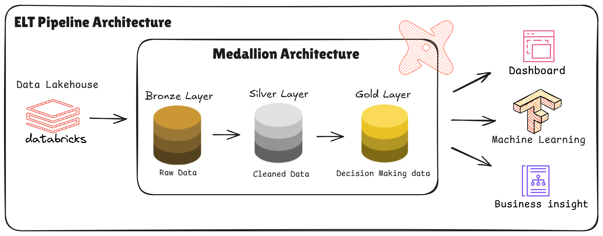

# 🛒 E-Commerce ELT Pipeline Data Warehouse using dbt

Building a lakehouse-based data warehouse to transform raw e-commerce data into analytics-ready datasets.

---

## ⚠️ Problem Statement

- Data is distributed across multiple tables with inconsistent structures (orders, items, payments, reviews, etc.)
- No consistent data model for analytics
- Difficulty in calculating key business KPIs:
  - Customer Lifetime Value  
  - Delivery Performance  
  - Revenue per Customer  
- Raw data is not ready for BI or decision-making

---

## 🏗️ Implementation

ELT Pipeline using Medallion Architecture:

- 🥉 **Bronze Layer**
  - Raw, unprocessed data (Delta Lake)

- 🥈 **Silver Layer**
  - Cleaned and transformed data (normalization, standardization)

- 🥇 **Gold Layer**
  - Business-ready data for dashboards and machine learning

- ✅ **Data Quality**
  - Implemented dbt tests:
    - `not_null`
    - `unique`
    - `relationships`

---

## 🔄 Workflow (Pipeline)

1. **Data Ingestion**
   - Raw data from APIs, scraping, and internal systems
   - Stored in Bronze Layer using Databricks Lakehouse

2. **Data Transformation (Silver Layer)**
   - **Staging Models**
     - Data cleaning
     - Format standardization
     - Column data type adjustment

   - **Intermediate Models**
     - Feature engineering
     - Table joins
     - Data enrichment

   - **dbt Tests**
     - Duplicate checks
     - Missing values
     - Data type validation
     - Business logic validation

3. **Data Serving (Gold Layer)**
   - Final datasets for:
     - Business stakeholders
     - Dashboards
     - Machine learning models

---

## 🥇 Gold Layer

### 1. Data Mart / Aggregated Tables

- Aggregated based on business needs (daily, weekly, monthly)
- Examples:
  - Revenue per day
  - Active users
  - Churn rate
- Denormalized schema for fast querying

### 2. Business Metrics Layer

- Single source of truth for KPIs
- Examples:
  - GMV
  - Conversion Rate
  - Retention Rate
- Managed via dbt metrics / semantic layer

### 3. Serving Models

- Ready for:
  - BI tools (Tableau, Power BI, Looker)
  - API consumption
  - Feature Store for ML

---

## 🤖 Machine Learning Layer

### 1. Feature Store Integration

- Databricks Feature Store
- Reusable and consistent features (training & inference)

### 2. Model Training Pipeline

- Training using Gold Layer / Feature Store data
- Experiment tracking with MLflow

### 3. Model Serving

- Batch inference (daily scoring)
- Real-time inference via API

---

## 🛠️ Technology Stack

- **Databricks** → Storage & compute  
- **dbt (Data Build Tool)** → Transformation & modeling  
- **SQL** → Query & transformation logic  
- **Medallion Architecture** → Pipeline design  
- **Delta Lake** → Scalable data storage  

---

## ✨ Key Features

- Modular data pipelines  
- Star schema modeling  
- Business metric-ready datasets  
- Data quality validation  

---

## 📈 Impact

- Analytics-ready data warehouse  
- Machine learning-ready datasets  
- Customer 360 insights  

---

## 🔮 Future Improvements

- Implement incremental models  
- Add orchestration (Airflow, Databricks Jobs)  
- Integrate with BI tools (Power BI, Tableau)  
- Optimize pipeline performance  
- Implement dbt snapshots for tracking customer/seller changes  
